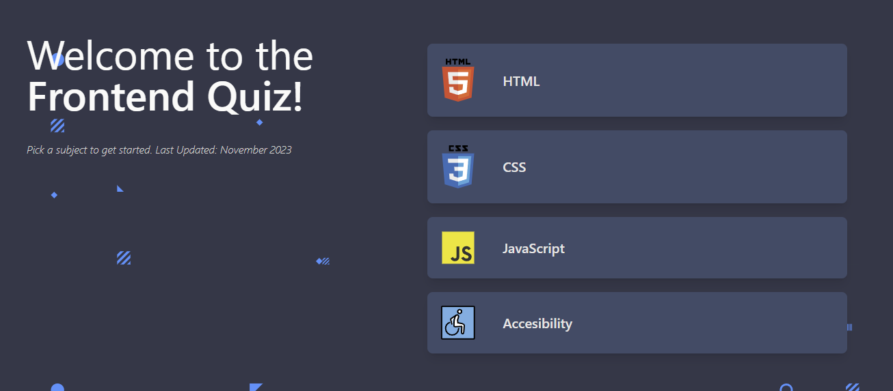

  

 

# FrontendQuiz

¿Eres un experto en HTML? ¿Conoces todas las propiedades y selectores de CSS? ¿Sabes cómo funciona JavaScript? ¡Pon a prueba tus habilidades y conviértete en un maestro de las tecnologías web!

En FrontendQuiz encontrarás preguntas de diferentes niveles de dificultad, desde lo más básico hasta lo más avanzado. También podrás elegir entre diferentes temas, como HTML, CSS, JavaScript, accesibilidad, etc.

¿Quieres aprender más sobre una tecnología específica? Visita el apartado de FrontendWiki, donde encontrarás información detallada sobre cada tema, incluyendo ejemplos de código, tutoriales y más.

¡No esperes más y empieza a jugar!

[Sitio Web](https://frontend-quiz-xavi.vercel.app/) 🖥️

## Sobre el proyecto

* Diseño responsive, garantizando que los usuarios puedan disfrutar plenamente de la aplicación independientemente del dispositivo que utilicen, desde un teléfono móvil hasta una pantalla de escritorio.

<!--  -->

## Tecnologías utilizadas

&nbsp;&nbsp;&nbsp;